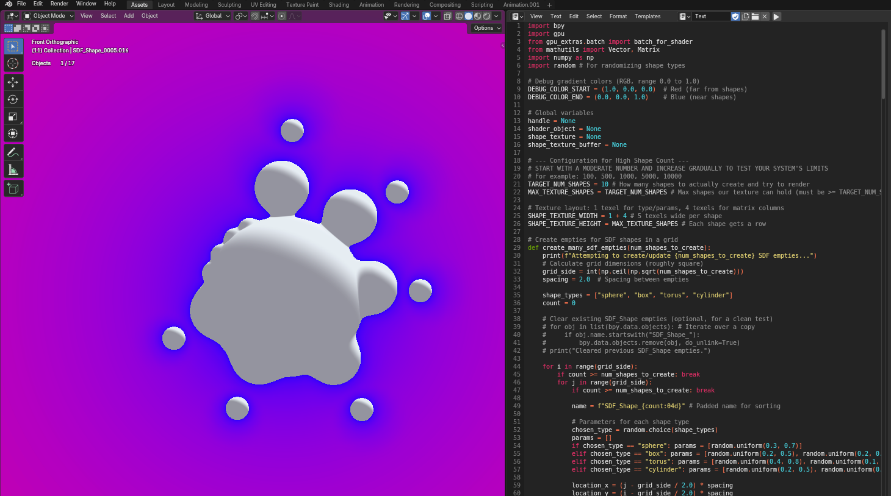

SDF demo done with Blender GPU module.

Copy python code and paste it in text editor, run the code to see render. You can duplicate, move, rotate and scale shapes. Performance is not that great with the more shapes you add. Ive tested with 100 shapes on RTX 3070 and its sluggish, 1000 shapes make FPS <1 so be aware of this.
