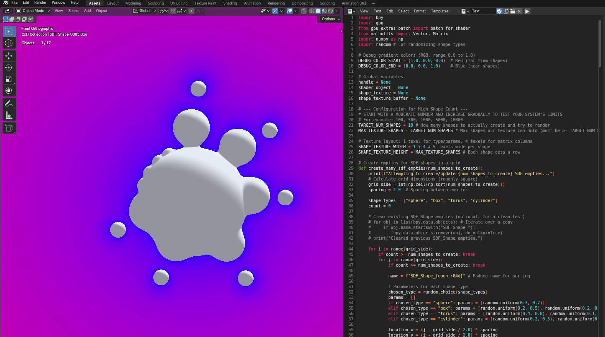
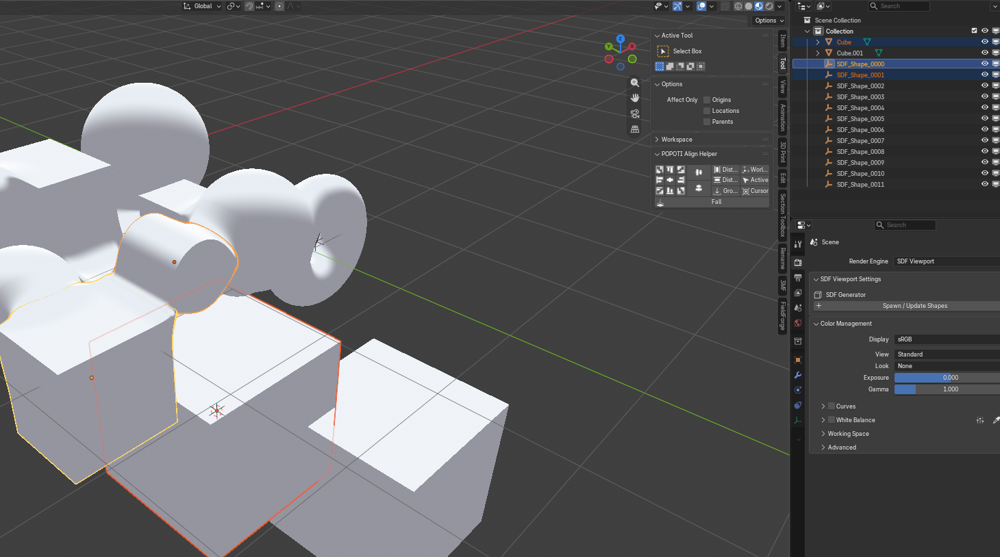

SDF demo done with Blender GPU module.

Copy python code and paste it in text editor, run the code to see render. You can duplicate, move, rotate and scale shapes. Performance is not that great with the more shapes you add. Ive tested with 100 shapes on RTX 3070 and its sluggish, 1000 shapes make FPS <1 so be aware of this.

Native Blender Demo added (Tested only on Blender 5.0).

To see this demo clone Blender source code from git compile and make sure you can run it.
Then copy folder "sdf_viewport" to the /blender/source/blender/draw/engines/ then compile again.

When you run compiled Blender, you can select "SDF Viewport" from render engine dropdown.
